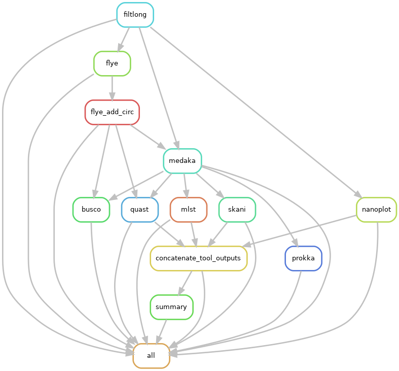

# nanofunQC
A quality control workflow implemented in Snakemake to assemble Nanopore (long read) data for Candida auris. It is a modified version of nanoQC (https://github.com/Snitkin-Lab-Umich/nanoQC).

## Summary

This pipeline performs the following steps:

- Runs [Filtlong](https://github.com/rrwick/Filtlong) to remove low quality reads and discards reads less than 1000 Bp.
- Generates pre and post-Filtlong QC plots using [Nanoplot](https://github.com/wdecoster/NanoPlot).
- Assemble clean filtlong nanopore reads with [Flye](https://github.com/fenderglass/Flye) assembler.
- Flye assembly is then polished with long reads using [Medaka](https://github.com/nanoporetech/medaka)
- The medaka assembly is then passed through [Prokka](https://github.com/tseemann/prokka) for annotation, [skani](https://github.com/bluenote-1577/skani) to identify closest reference genome, and [MLST](https://github.com/tseemann/mlst) for determining sequence type based on sequences of housekeeping genes
- Flye and medaka assemblies are then run on [BUSCO](https://busco.ezlab.org/) for assembly completeness statistics and [QUAST](https://quast.sourceforge.net/) for assembly statistics.

The output from each step is contained in its own folder, as shown below. 

```
results
└── run_name
    ├── busco
    ├── filtlong
	├── flye
	├── medaka
	├── nanoplot
	├── quast
	├── repeatmasker
	└── funannotate
		└──sample_name
			├── interproscan
			└── eggnog
```


## Installation

> Clone the github directory onto your system.

```

git clone https://github.com/Snitkin-Lab-Umich/nanoQC.git

```

> Download the GeneMark license and place it in your home directory, if you haven't already.

```

module load Bioinformatics snakemake singularity

```


This workflow makes use of singularity containers available through [State Public Health Bioinformatics group](https://github.com/StaPH-B/docker-builds). If you are working on [Great Lakes](https://its.umich.edu/advanced-research-computing/high-performance-computing/great-lakes) (UofM HPC)—you can load snakemake and singularity modules as shown above. However, if you are running it on your local machine or other computing platform, ensure you have snakemake and singularity installed.

## Setup config and sample files

### Customize config.yaml and set tool specific parameters
As an input, the snakemake file takes a config file where you can set the path to `samples.tsv`, path to Nanopore long reads, path to adapter file etc. Instructions on how to modify `config/config.yaml` is found in the file itself.

### Samples

`config/samples.tsv` should be a comma seperated file consisting of one column—barcode_id.

You can create `samples.tsv` file using the following for loop. It assumes that you are running for loop from the folder that contains your long read.

If your raw reads folder looks like this, you will not be able to run nanoQC.  

```
(base) [dhatrib@gl-login2 nanoQC]$ ls /nfs/turbo/umms-esnitkin/Raw_sequencing_data/G6C
Lojek_G6C_10.fastq.gz  Lojek_G6C_17.fastq.gz  Lojek_G6C_23.fastq.gz  Lojek_G6C_2.fastq.gz   Lojek_G6C_36.fastq.gz  Lojek_G6C_42.fastq.gz  Lojek_G6C_49.fastq.gz  Lojek_G6C_9.fastq.gz
Lojek_G6C_11.fastq.gz  Lojek_G6C_18.fastq.gz  Lojek_G6C_24.fastq.gz  Lojek_G6C_30.fastq.gz  Lojek_G6C_37.fastq.gz 
```

To ensure the format of the raw reads are compatible with the pipeline, we need to create a folder with the corresponding sample name. 

> To move the raw read to its corresponding folder name, we will use `move_long_reads_to_corr_folders.sh`. Type the folllowing command on your terminal. 

```
./workflow/scripts/move_long_reads_to_corr_folders.sh 
```

> You now need to give it a fastq direcotry 

```
./workflow/scripts/move_long_reads_to_corr_folders.sh /path/to/long/reads
```

> You should see the folders corresponding with your sample name in your long read directory

```
(base) [dhatrib@gl-login2 nanoQC]$ ls /nfs/turbo/umms-esnitkin/Raw_sequencing_data/G6C
Lojek_G6C_10  Lojek_G6C_17 Lojek_G6C_23  Lojek_G6C_2   Lojek_G6C_36  Lojek_G6C_42

```

> You can create `config/samples.tsv` file using the following for loop. Instead of `/path/to/your/data/`, give the path to your long reads.  `fastq-File-Pattern*` would be if your samples looked like this: `Lojek_G6C_10, Lojek_G6C_17, Lojek_G6C_23`, the wildcard pattern that would catch all the samples would `Lojek_G6C*`. 

```
echo "barcode_id" > config/samples.tsv

for folder in /path/to/your/data/fastq-File-Pattern*; do
    if [ -d "$folder" ]; then
        echo "$(basename "$folder")";
    fi;
done >> config/samples.tsv

```

> Check if `samples.tsv` is populated with your samples. Hit `q` to exit.

```
less config/samples.tsv
```

## Quick start

### Run nanoQC on a set of samples.


>Preview the steps in nanoQC by performing a dryrun of the pipeline.

```

snakemake -s workflow/nanoQC.smk --dryrun -p

```
>Run the pipeline. 
```

snakemake -s workflow/nanoQC.smk -p --use-singularity --use-envmodules --use-conda -j 999 --cluster "sbatch -A {cluster.account} -p {cluster.partition} -N {cluster.nodes}  -t {cluster.walltime} -c {cluster.procs} --mem-per-cpu {cluster.pmem} --output=slurm_out/slurm-%j.out" --conda-frontend conda --cluster-config config/cluster.json --configfile config/config.yaml --latency-wait 1000 --nolock 

```




You can generate a MultiQC report on prokka, quast, busco and nanoplot folders after you finish running the snakemake workflow above.

>Activate multiqc using conda.

```

module load multiqc

```
> Change `multiqc_report_filename` to a file name of your choice and `multiqc_output_dir` to an output directory name of your choosing. Run multiqc on output folders specified above.
```

multiqc --filename multiqc_report_filename -o multiqc_output_dir -f prokka/ busco/ quast/ nanoplot/

```

## Dependencies

### Near Essential
* [Snakemake>=7.32.4](https://snakemake.readthedocs.io/en/stable/#)
<!--* [Conda](https://docs.conda.io/en/latest/)

All the necessary software stack required for the workflow will be installed using conda package manager.-->

### Tool stack used in workflow

* [Filtlong](https://github.com/rrwick/Filtlong)
* [Nanoplot](https://github.com/wdecoster/NanoPlot)
* [Flye](https://github.com/fenderglass/Flye)
* [Medaka](https://github.com/nanoporetech/medaka)
* [Prokka](https://github.com/tseemann/prokka)
* [skani](https://github.com/bluenote-1577/skani)
* [mlst](https://github.com/tseemann/mlst)
* [BUSCO](https://busco.ezlab.org/)
* [QUAST](https://quast.sourceforge.net/)
* [MultiQC](https://multiqc.info/)
* [Pandas](https://pandas.pydata.org/)

